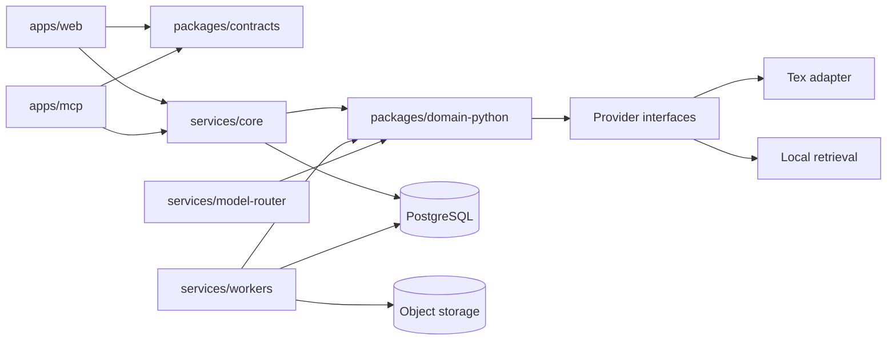

# Codebase Context Map for AI Agents

Version: **1 — Phase 1 candidate**
Date: **2026-07-15**
Implementation status: **Phase 1 corrections complete; revised report submitted; previous Codex verdict FAIL; correction round 2 pending re-audit. No product domain behavior.**

This map tells an AI agent where Memdot responsibilities live and which
invariants constrain work. Target-only entries remain labelled. Verified paths
and commands below were inspected during Phase 1.

## 1. Mandatory reading order

Before any implementation change:

1. Read repository `AGENTS.md`.
2. Read repository [execution context](../../CONTEXT.md).
3. Read the [implementation plan](../../IMPLEMENTATION_PLAN.md) and active phase
   in the [implementation tracker](../../IMPLEMENTATION_TRACKER.md).
4. Read [documentation index](../README.md).
5. Read the owning PRD/FSD requirements.
6. Read the relevant ADRs.
7. Read the System Architecture and owning TRD contracts.
8. Read the security controls and evaluation gates for the affected subsystem.
9. After code exists, inspect the actual implementation and tests; this map
   never replaces repository truth.

## 2. Monorepo shape

Verified scaffold paths:

```text
apps/
  web/                 Next.js PWA shell (health only)
  mcp/                 TypeScript MCP edge skeleton (health only)
services/
  core/                FastAPI Core skeleton + OpenAPI owner
  workers/             Workers health skeleton
  model-router/        Model-router health skeleton
packages/
  contracts/           Generated OpenAPI/JSON Schema/event schemas
  domain-python/       Domain types + provider ports
  provider-adapters/   Concrete adapters depending inward on ports
  ui/                  Accessible frontend primitives
infra/
  compose/             Placeholder (Phase 2 topology)
  hosted/              Placeholder (later hosted infra)
docs/                  Product, technical, ADR, evaluation, AI context
tests/
  benchmark/           Placeholder for frozen evaluation corpora
  security/            Placeholder for adversarial suites
  boundaries/          Dependency-boundary tests
  contracts/           Schema/OpenAPI compatibility tests
scripts/               Verified repository automation
```

Do not create both TypeScript and Python implementations of the same domain
policy. Python owns canonical domain logic. TypeScript consumes generated
OpenAPI/JSON Schema contracts and owns protocol/UI translation.

## 3. Allowed dependency direction



Enforcement (verified in Phase 1):

- TypeScript: ESLint `no-restricted-imports` + `dependency-cruiser.cjs`
- Python: `import-linter` contracts in root `pyproject.toml`
- Docs: [docs/architecture/DEPENDENCY_BOUNDARIES.md](../architecture/DEPENDENCY_BOUNDARIES.md)

Forbidden dependencies:

- Web or MCP directly querying PostgreSQL, object storage, Tex, or model vendors.
- Tex/provider IDs entering public contracts or becoming canonical foreign keys.
- Workers importing UI modules.
- Provider adapters deciding account permission, revision truth, or deletion.
- Model output directly mutating canonical memory or authored documents.

## 4. Ownership map

| Domain                          | Owner             | Canonical records/contracts                                      |
| ------------------------------- | ----------------- | ---------------------------------------------------------------- |
| Identity and account membership | Core              | accounts, users, sessions, external grants _(later)_             |
| Spaces and privacy              | Core              | spaces, private policy, memberships _(later)_                    |
| Sources and revisions           | Core              | sources, source_revisions, blobs metadata _(later)_              |
| Authored documents              | Core              | documents, document_revisions, MemdotDocument schema _(Phase 6)_ |
| Ingestion execution             | Workers           | jobs/stage attempts _(later)_                                    |
| Normalised content              | Core + workers    | parse_runs, elements _(later)_                                   |
| Approved/proposed memory        | Core              | memory_records, proposals _(later)_                              |
| Conversations                   | Core              | conversations, turns _(later)_                                   |
| Learning                        | Core/domain       | curriculum, events _(later)_                                     |
| Retrieval/context               | Domain            | intent, routes, receipts _(later)_                               |
| External projections            | Workers/providers | rebuildable _(later)_                                            |
| Model egress                    | Model router      | provider policies _(later)_                                      |
| MCP                             | MCP app           | protocol mapping; health only in Phase 1                         |
| Public REST                     | Core              | OpenAPI owned by Core; generated into `packages/contracts`       |

## 5. Provider interfaces

Interfaces are narrow and replaceable. Phase 1 defines the
`MemoryProviderPort` scaffold only. Full adapters arrive in later phases.

## 6. Canonical transaction and event rules

Unchanged target rules from founding docs. No ledger implementation yet.

## 7. Public interface ownership

### MCP app

Frozen tools remain target state. Phase 1 exposes health/readiness only.

### REST API

Core owns OpenAPI generation (`scripts/generate_openapi.py`). TypeScript types
are generated into `packages/contracts/generated/openapi/`.

### Events

Versioned event schema layout exists under
`packages/contracts/schemas/events/` with additive-field compatibility policy.
Production domain events are not invented in Phase 1.

## 8. Invariants an AI agent must never break

1. PostgreSQL is canonical; Tex, vector indexes, caches, and read models are
   rebuildable.
2. Private spaces never appear in external AI candidate sets, results, receipts,
   or captured context.
3. Every returned evidence item has an immutable canonical ID, revision, and
   user-openable locator.
4. Deleted, retracted, or superseded content is not current by default.
5. Pending proposals are excluded from ordinary retrieval.
6. AI writes and document changes require user approval.
7. External interaction capture is best effort and visibly labelled; never claim
   passive full-host capture.
8. Conversations do not raise learning evidence automatically.
9. Answer keys remain sealed before submission.
10. User content persists until explicit deletion; telemetry cannot become a
    shadow content store.
11. The self-hosted product remains functional without Tex or paid model APIs.
12. `search` and `fetch` keep their exact compatibility signatures and absolute
    user-openable citation URLs.
13. Rich document JSON is canonical; HTML/Markdown/Notion are adapters.
14. Same input plus profile produces deterministic ingestion identities.

## 9. Change routing

| Change                | Read first                            | Required verification                                         |
| --------------------- | ------------------------------------- | ------------------------------------------------------------- |
| Screen or user flow   | PRD, FSD, related ADR                 | Component, accessibility, responsive, error-state tests       |
| Rich-document node    | FSD editor flow, ADR-0009, TRD schema | JSON round-trip, migration, import/export, XSS fixtures       |
| Ingestion/parser      | ADR-0004, TRD ingestion, evaluation   | Golden corpus, deterministic IDs, provenance, retry           |
| Retrieval/ranking     | ADR-0003/0005/0006                    | Frozen benchmark, slices, citation and fallback parity        |
| MCP/REST              | ADR-0007/0008, TRD API                | Schema, OAuth, idempotency, client compatibility, enumeration |
| Learning evidence     | ADR-0012                              | Event properties, sealed answers, replay, FSRS projection     |
| Notion                | ADR-0014                              | Mapping fixtures, pagination, conflict, write boundary        |
| Auth/privacy/deletion | Security model and related ADRs       | Cross-account suite, revoke, restore/deletion drill           |
| Deployment/provider   | ADR-0010/0011                         | Tex-disabled Compose, SBOM, secrets, regional config          |
| Scaffold/tooling      | ADR-0011, TRD-SYS/DEP                 | `make check`, contracts freshness, boundary tests             |

## 10. Safe extension seams

Unchanged from founding guidance. Forbidden shortcuts remain forbidden.

## 11. Commands

Verified Phase 1 root commands:

```bash
make bootstrap
make format
make format-check
make lint
make typecheck
make test
make contracts
make docs-validate
make build
make containers
make container-smoke
make check
make clean
make workspace-list
```

Contract generation:

```bash
uv run python scripts/generate_openapi.py
pnpm --filter @memdot/contracts run generate
pnpm --filter @memdot/contracts run check
uv run python scripts/validate_schemas.py
```

Documentation validation:

```bash
uv run python scripts/validate_docs.py
node --import ./scripts/mermaid-preload.mjs scripts/validate_mermaid.mjs
./scripts/check_whitespace.sh
```

An AI agent must inspect manifests and CI before inventing a command.

## 12. Maintenance

Update this file in the same change whenever a service/path is scaffolded,
ownership moves, an interface or event version changes, or a verified command is
added. Replace target paths with confirmed paths incrementally. A status report
must distinguish documented target state from implemented and verified current
state.

History note: Version 0 was documentation-only target state. Version 1 records
the Phase 1 scaffold candidate. Corrections are complete and a revised report is
submitted; Codex re-audit (round 2) is pending before any owner-authorized commit.
