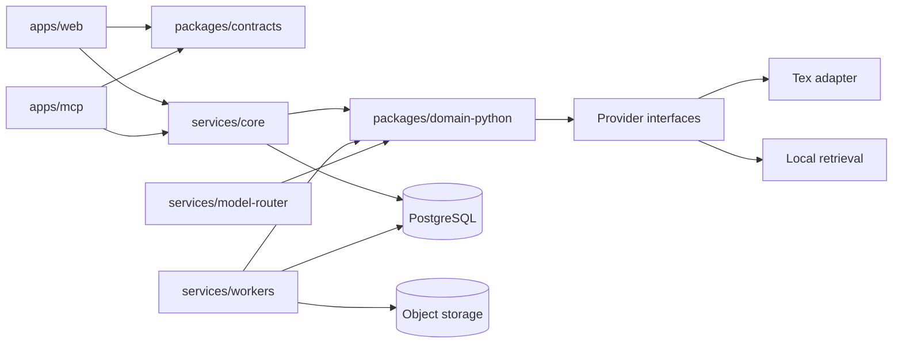

# Codebase Context Map for AI Agents

Version: **4.0 — Phase 3 accepted; 10-wave execution model**
Date: **2026-07-16**
Implementation status: **Technical Phases 1–3 are accepted at `e77b299`.
Wave 4 Core runtime/ingestion is implemented on `main`; Waves 5–6 continue in
the same owner-authorized run. Combined gates run at the end of Wave 6.
Prompts and reports are chat-only.**

This map tells an AI agent where Memdot responsibilities live and which
invariants constrain work. Target-only entries remain labelled. Verified paths
and commands below were inspected during Phase 1.

## 1. Mandatory reading order

Before any implementation change:

1. Read repository `AGENTS.md`.
2. Read repository [execution context](../../CONTEXT.md).
3. Read the [implementation plan](../../IMPLEMENTATION_PLAN.md) and active phase
   in the [implementation tracker](../../IMPLEMENTATION_TRACKER.md).
4. Read [documentation index](../README.md).
5. Read the owning PRD/FSD requirements.
6. Read the relevant ADRs.
7. Read the System Architecture and owning TRD contracts.
8. Read the security controls and evaluation gates for the affected subsystem.
9. After code exists, inspect the actual implementation and tests; this map
   never replaces repository truth.

## 2. Monorepo shape

Verified scaffold paths:

```text
apps/
  web/                 Next.js shell (health only; frontend starts Wave 9)
  mcp/                 MCP edge (health only; tools arrive Wave 7)
services/
  core/                FastAPI, auth, tenancy, ledger, sources API, documents/memory/
                       context APIs, jobs/outbox, ingestion orchestration, migrations
  workers/             Workers health; ingestion pipeline; projection rebuild helpers
  model-router/        Local echo/structured completion stub with budget policy
packages/
  contracts/           Generated OpenAPI/JSON Schema/event schemas
  domain-python/       Domain types, MemdotDocument, retrieval fusion, context compiler,
                       provider ports (model, retrieval)
  provider-adapters/   Concrete adapters depending inward on ports
  ui/                  Accessible frontend primitives
infra/
  compose/             Accepted Tex-disabled self-host Compose
  hosted/              Placeholder (later hosted infra)
docs/                  Product, technical, ADR, evaluation, AI context
tests/
  benchmark/           Placeholder for frozen evaluation corpora
  security/            Live cross-account/Private-Space adversarial suites
  boundaries/          Dependency-boundary tests
  contracts/           Schema/OpenAPI compatibility tests
scripts/               Verified repository automation
```

Do not create both TypeScript and Python implementations of the same domain
policy. Python owns canonical domain logic. TypeScript consumes generated
OpenAPI/JSON Schema contracts and owns protocol/UI translation.

## 3. Allowed dependency direction



Enforcement (verified in Phase 1):

- TypeScript: ESLint `no-restricted-imports` + `dependency-cruiser.cjs`
- Python: `import-linter` contracts in root `pyproject.toml`
- Docs: [docs/architecture/DEPENDENCY_BOUNDARIES.md](../architecture/DEPENDENCY_BOUNDARIES.md)

Forbidden dependencies:

- Web or MCP directly querying PostgreSQL, object storage, Tex, or model vendors.
- Tex/provider IDs entering public contracts or becoming canonical foreign keys.
- Workers importing UI modules.
- Provider adapters deciding account permission, revision truth, or deletion.
- Model output directly mutating canonical memory or authored documents.

## 4. Ownership map

| Domain                          | Owner             | Canonical records/contracts                                  |
| ------------------------------- | ----------------- | ------------------------------------------------------------ |
| Identity and account membership | Core              | accounts, users, sessions, identities, external grants       |
| Spaces and privacy              | Core              | spaces, memberships, visibility, FORCE RLS                   |
| Sources and revisions           | Core              | source/revision/blob/upload_intent APIs and lifecycle        |
| Ingestion execution             | Core + workers    | durable jobs, outbox, parser orchestration in Core           |
| Normalised content              | Core              | parse_runs, document_element, active parse pointer promotion |
| Approved/proposed memory        | Core              | `services/core/src/memdot_core/memory/`                      |
| Authored documents              | Core              | `services/core/src/memdot_core/documents/`                   |
| Retrieval/context               | Core + domain     | `context/`, `packages/domain-python/retrieval.py`, compiler  |
| External projections            | Workers/providers | `workers/projections/rebuild.py`, provider adapters          |
| Model egress                    | Model router      | `services/model-router/` policy + `/v1/complete` stub        |
| MCP                             | MCP app           | protocol mapping; health only in Phase 1                     |
| Public REST                     | Core              | auth/health now; Wave 4 expands generated OpenAPI            |

## 5. Provider interfaces

Interfaces are narrow and replaceable. Provider adapters depend inward on
domain ports and never own canonical IDs, authorization, revisions, or deletion.

## 6. Canonical transaction and event rules

Phase 3 implements frozen Alembic migrations, separate migrate/runtime roles,
FORCE RLS, signed tenant context, immutable/append-only ledger constraints, and
atomic current-pointer plus outbox functions. Wave 4 must extend these seams; it
must not introduce runtime DDL, direct pointer mutation, unsigned tenant GUCs,
or non-transactional canonical/outbox writes.

## 7. Public interface ownership

### MCP app

Frozen tools remain target state. Phase 1 exposes health/readiness only.

### REST API

Core owns OpenAPI generation (`scripts/generate_openapi.py`). TypeScript types
are generated into `packages/contracts/generated/openapi/`.

### Events

Versioned event schema layout exists under
`packages/contracts/schemas/events/` with additive-field compatibility policy.
Production job/domain events are frozen in Wave 4 before consumers depend on them.

## 8. Invariants an AI agent must never break

1. PostgreSQL is canonical; Tex, vector indexes, caches, and read models are
   rebuildable.
2. Private spaces never appear in external AI candidate sets, results, receipts,
   or captured context.
3. Every returned evidence item has an immutable canonical ID, revision, and
   user-openable locator.
4. Deleted, retracted, or superseded content is not current by default.
5. Pending proposals are excluded from ordinary retrieval.
6. AI writes and document changes require user approval.
7. External interaction capture is best effort and visibly labelled; never claim
   passive full-host capture.
8. Conversations do not raise learning evidence automatically.
9. Answer keys remain sealed before submission.
10. User content persists until explicit deletion; telemetry cannot become a
    shadow content store.
11. The self-hosted product remains functional without Tex or paid model APIs.
12. `search` and `fetch` keep their exact compatibility signatures and absolute
    user-openable citation URLs.
13. Rich document JSON is canonical; HTML/Markdown/Notion are adapters.
14. Same input plus profile produces deterministic ingestion identities.

## 9. Change routing

| Change                | Read first                            | Required verification                                         |
| --------------------- | ------------------------------------- | ------------------------------------------------------------- |
| Screen or user flow   | PRD, FSD, related ADR                 | Component, accessibility, responsive, error-state tests       |
| Rich-document node    | FSD editor flow, ADR-0009, TRD schema | JSON round-trip, migration, import/export, XSS fixtures       |
| Ingestion/parser      | ADR-0004, TRD ingestion, evaluation   | Golden corpus, deterministic IDs, provenance, retry           |
| Retrieval/ranking     | ADR-0003/0005/0006                    | Frozen benchmark, slices, citation and fallback parity        |
| MCP/REST              | ADR-0007/0008, TRD API                | Schema, OAuth, idempotency, client compatibility, enumeration |
| Learning evidence     | ADR-0012                              | Event properties, sealed answers, replay, FSRS projection     |
| Notion                | ADR-0014                              | Mapping fixtures, pagination, conflict, write boundary        |
| Auth/privacy/deletion | Security model and related ADRs       | Cross-account suite, revoke, restore/deletion drill           |
| Deployment/provider   | ADR-0010/0011                         | Tex-disabled Compose, SBOM, secrets, regional config          |
| Scaffold/tooling      | ADR-0011, TRD-SYS/DEP                 | `make check`, contracts freshness, boundary tests             |

## 10. Safe extension seams

Unchanged from founding guidance. Forbidden shortcuts remain forbidden.

## 11. Commands

Verified Phase 1 root commands:

```bash
make bootstrap
make format
make format-check
make lint
make typecheck
make test
make contracts
make docs-validate
make build
make containers
make container-smoke
make check
make clean
make workspace-list
```

Verified Phase 2 commands:

```bash
make compose-config
make compose-up
make compose-ps
make compose-logs
make compose-down
make selfhost-smoke
```

`make selfhost-smoke` is a scheduled checkpoint command, not a routine per-wave
gate. The next runs are after technical Phase 8 and technical Phase 11 only,
subject to the smoke-owned-seam exception in `AGENTS.md`.

Verified Phase 3 commands:

```bash
make migrate-domain
make check-rls
make phase3-gates
```

Verified Phase 4 (Wave 4) focused gate:

```bash
make phase4-gates
```

Wave 4 Core paths (implemented on working tree):

```text
services/core/src/memdot_core/
  request_context.py   Authenticated request context
  errors.py            application/problem+json registry
  pagination.py        Signed opaque cursors
  idempotency.py       Idempotency-key replay/conflict
  policy.py            Rate/concurrency/size policy hooks
  sources/             Source upload/version/status API
  jobs/                Outbox claim/ack and job lifecycle
  storage/             S3 and in-memory object storage
  ingestion/           Parse orchestration and promotion
  parsers/             Native text/PDF/OCR stub adapters
services/core/alembic/versions/20260717_0002_phase4_runtime.sql
packages/domain-python/src/memdot_domain/
  ingestion.py         Processing statuses and element kinds
  object_keys.py       Immutable object key construction
  ports/object_storage.py
  ports/parser.py
packages/contracts/schemas/events/source.*.v1.json
```

Operator entrypoints live under `infra/compose/` (`README.md`, `images.lock.yaml`,
`scripts/`). Domain migrations use `memdot_migrate`; Core runtime uses `memdot_core`.

Contract generation:

```bash
uv run python scripts/generate_openapi.py
pnpm --filter @memdot/contracts run generate
pnpm --filter @memdot/contracts run check
uv run python scripts/validate_schemas.py
```

Documentation validation:

```bash
uv run python scripts/validate_docs.py
node --import ./scripts/mermaid-preload.mjs scripts/validate_mermaid.mjs
./scripts/check_whitespace.sh
```

An AI agent must inspect manifests and CI before inventing a command.

## 12. Maintenance

Update this file in the same change whenever a service/path is scaffolded,
ownership moves, an interface or event version changes, or a verified command is
added. Replace target paths with confirmed paths incrementally. A status report
must distinguish documented target state from implemented and verified current
state.

History note: Version 0 was documentation-only target state. Version 1 records
the accepted Phase 1 scaffold. Version 2 tracked the Phase 2 candidate. Version
3 records Phase 2 acceptance and the owner-authorized Phase 3 start.
