# Memdot System Architecture

| Field | Value |
|---|---|
| Status | v1 target architecture |
| Version | 1.0 |
| Scope | Hosted India beta and complete Docker self-host deployment |
| Companion specification | [Technical Requirements](TRD.md) |

## 1. Founder summary

Memdot keeps two fundamentally different things separate:

1. **Canonical evidence** is the durable, user-owned record: original sources, exact revisions, authored documents, provenance, approved memories, conversations, learning attempts, and deletion decisions. PostgreSQL and object storage own it.
2. **Derived intelligence** is disposable and reproducible: parser runs, chunks, embeddings, Tex memories, graph suggestions, reranked candidates, summaries, and model outputs. Workers can rebuild it from canonical evidence.

The Context Compiler sits between evidence and every AI. It resolves who is asking, excludes ineligible/private data, combines exact, historical, graph, Tex, and OSS semantic candidates, verifies each candidate against canonical state, detects conflicts, fits the result to a budget, and issues a receipt. This—not a larger vector database—is Memdot's architectural differentiator.

PostgreSQL remains authoritative because Tex itself advises keeping an authoritative log separately: [Tex migration guidance](https://github.com/metacoglabs/docs/blob/852c4cf105df58e488a1e9e8a877e3a4524dd113/migration/from-redis.mdx#L78-L83). Tex can improve hosted recall only after its contract gates pass; it can be disabled without losing Memdot functionality or user data.

## 2. Architecture principles and invariants

1. **Canonical before clever.** No provider response can create, replace, authorize, or delete canonical truth.
2. **Immutable evidence, mutable pointers.** Sources, documents, assessment items, and learner events are versioned/append-only; “current” is an atomic pointer.
3. **Authorization twice.** Calculate eligibility before retrieval and reauthorize canonical candidates after provider retrieval.
4. **Private means externally impossible.** MCP/external OAuth actors cannot retrieve a private-space item even if they know its ID or a provider returns it.
5. **Proposals before AI writes.** Models and external agents can propose; a user decision creates canonical state.
6. **Receipts over invisible context.** Every compiled context records what was selected, omitted, conflicted, and why.
7. **Provider failure reduces quality, never integrity.** Tex/model/Notion/OCR outages produce explicit degraded or queued states.
8. **One behavioral product, two deployments.** Hosted GCP and Docker self-host use the same domain contracts, migrations, APIs, events, and acceptance suite.
9. **Content-minimized operations.** Logs and traces describe performance and routing but never copy learner content.
10. **Deletion outranks retries.** A tombstone stops work, invalidates projections, and is replayed after restore.

These invariants implement TRD-SYS-005..010, TRD-DATA-004..014, TRD-RET-001..019, and TRD-SEC-001..013.

## 3. System context

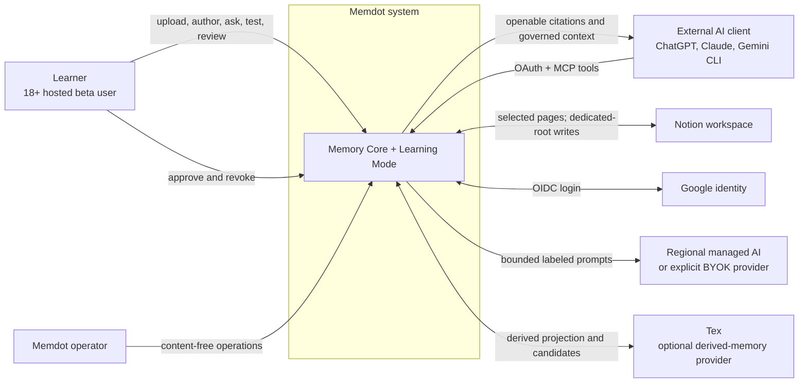

### 3.1 Actors and trust

| Actor/system | Trusted for | Not trusted for |
|---|---|---|
| Learner browser | Explicit intent and user decisions after authentication | Authorization enforcement, answer secrecy, durable state |
| External AI client | Calling granted MCP tools | Complete chat capture, safe handling after disclosure, private-space access |
| Google identity | Hosted authentication assertion | Memdot product authorization |
| Notion | Its native page/version response | Canonical history, ordering of webhooks, Memdot permissions |
| Tex | Candidate recall after validation | Audit truth, stable public IDs, ACLs, deletion truth |
| Model provider | One bounded inference result | Facts, permissions, canonical writes, retention beyond its disclosed contract |
| Operator | Infrastructure recovery under JIT controls | Routine user-content access |

## 4. Container architecture

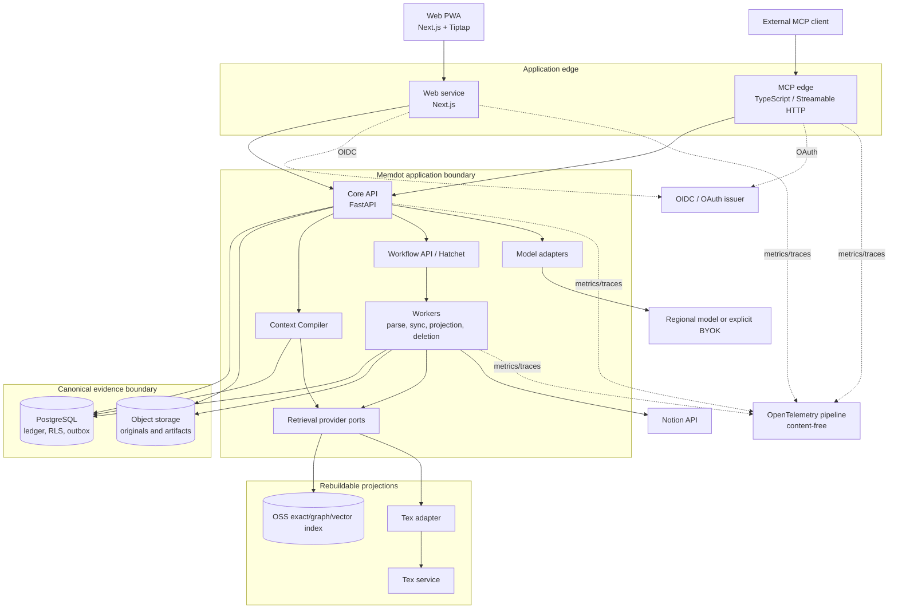

### 4.1 Ownership and dependency direction

```text
apps/web and apps/mcp
        ↓ generated public contracts
apps/api application services
        ↓ domain ports
domain model and policy
        ↑ adapter implementations
workers/providers/storage/identity/model integrations
```

- The core API is the only canonical domain-write entry point. A worker invokes the same application/domain commands under a signed job scope rather than bypassing policy.
- MCP is an edge protocol adapter. It cannot read PostgreSQL, object storage, Tex, or an external conversation directly.
- The Context Compiler consumes candidate-provider ports and canonical repositories; it does not call answer-generation models.
- Answer generation consumes the compiled context and receipt. It cannot request a broader scope mid-generation.
- Provider adapters return candidates and status, never already-authorized user responses.

## 5. Canonical and derived data topology

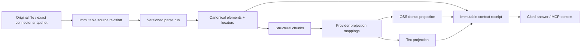

### 5.1 Canonical boundaries

- PostgreSQL owns account/space authorization, source and document revisions, normalized element metadata/text, provenance, conflicts, conversations, approved memory, course graph, assessment versions, append-only learner events, projection mappings, receipts, outbox, and deletion tombstones.
- Object storage owns immutable originals, exact Notion snapshots, raw parser output, page renders, extracted assets, and exports. Database rows bind an object generation and SHA-256; mutable bucket paths are forbidden.
- Text needed for citations and retrieval is canonical in PostgreSQL elements/chunks. An object-store outage must not make existing text citations resolve to unrelated content.
- Local and Tex indexes contain only versioned projections. Their identifiers are never returned directly to users.

### 5.2 Public identity chain

```text
public opaque item ID
  -> canonical item / immutable revision
  -> provenance locator and source revision
  -> projection mappings (zero or more providers)
```

Resolution always travels from public ID to canonical state. Reverse resolution from a provider ID is allowed only through a validated projection row followed by RLS and deletion checks.

## 6. Hosted deployment: India-first GCP

The hosted beta keeps canonical content and default managed inference in Mumbai. Delhi is disaster recovery, not an active read region in v1.

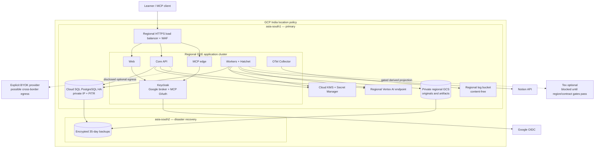

### 6.1 Hosted operational decisions

- The regional load balancer is the only public application ingress. PostgreSQL, storage, Hatchet, telemetry, and worker control planes have private networking.
- Keycloak brokers Google login so web identity and MCP OAuth share issuer/audience/revocation behavior. Google identity does not decide space permissions.
- The default model adapter uses a Mumbai regional managed endpoint, bounded stateless prompts, and provider storage/logging disabled where supported.
- Direct OpenAI/Anthropic/Google developer BYOK is opt-in and shown with provider geography/retention warnings. BYOK changes credential/payment, not those policies.
- Tex egress remains disabled until tenancy, stable IDs, deletion, source mapping, retry, SLA, residency, retention, and rebuild contract tests pass.
- Organization resource-location policy constrains content-bearing resources to India. Content-free DNS/certificate/control metadata is documented in the processor registry.
- Cloud SQL PITR target is seven days; daily encrypted backups expire after 35 days. Quarterly restore tests target RPO <=15 minutes and RTO <=4 hours.

Primary location references: [Cloud SQL regions](https://docs.cloud.google.com/sql/docs/postgres/region-availability-overview), [Cloud Storage locations](https://docs.cloud.google.com/storage/docs/locations), and [GCP location constraints](https://docs.cloud.google.com/organization-policy/restrict-locations).

## 7. Docker self-host deployment

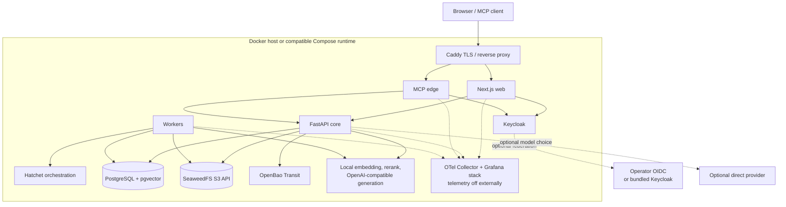

Self-host acceptance runs with no Tex configuration. Exact search, graph/temporal search, local dense retrieval, context receipts, Ask, proposals, Learning Mode, MCP, export, and deletion must all work. The operator chooses storage, backups, inference, residency, and OIDC configuration and receives secure non-production defaults rather than a false production-hardening claim.

OpenBao Transit encrypts connector/model credentials; see [OpenBao security](https://openbao.org/docs/internals/security/). Keycloak handles OIDC and MCP client registration; see [Keycloak client registration](https://www.keycloak.org/securing-apps/client-registration).

## 8. Source ingestion and reprocessing

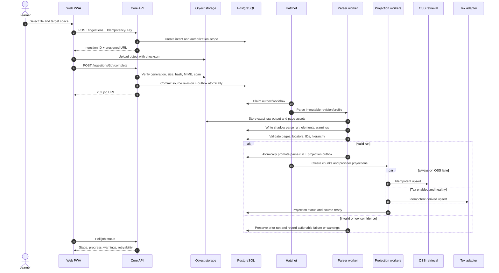

### 8.1 Reprocessing rules

- Reprocessing never overwrites the promoted parse run. It creates `UUIDv5(revision, parse-profile)` output and compares it in shadow.
- A successful atomic promotion updates the active parse-run pointer and emits projection work in one transaction.
- Every input page/block must be accounted for. Low confidence is visible; missing content cannot be marked ready.
- Identical snapshot, parse profile, and chunk profile converge on identical IDs and no duplicate provider work.
- If deletion is requested at any stage, the tombstone cancels further promotion and schedules artifact/provider purge.

## 9. Query planning and context compilation

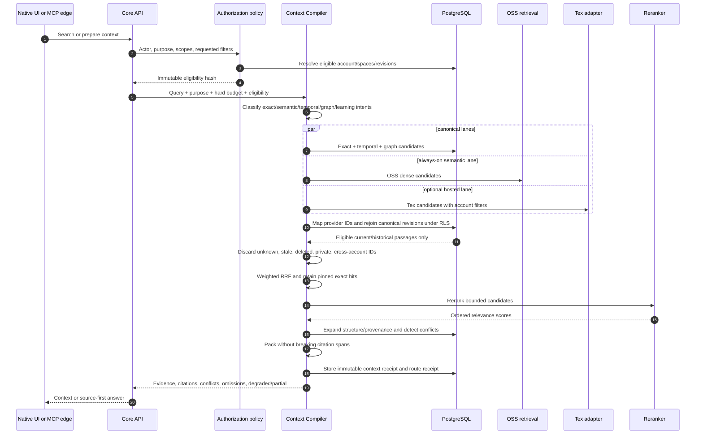

### 9.1 Compiler stages

1. **Authorize:** external OAuth actors get the complete eligible non-private account; first-party users may request their private spaces.
2. **Plan:** preserve exact lookup while adding semantic, temporal, graph, episodic, synthesis, or learning intents.
3. **Retrieve:** query PostgreSQL exact/history/graph, the always-on OSS dense lane, and Tex only while its circuit and contract are valid.
4. **Canonicalize:** translate every provider ID through a projection mapping and fetch the immutable canonical passage under RLS.
5. **Fuse/rerank:** deterministic weighted RRF, pinned exact hits, bounded semantic rerank.
6. **Expand:** add headings, neighboring blocks, table headers, provenance, and confirmed prerequisites after ranking.
7. **Conflict-check:** retain competing eligible assertions with independent citations.
8. **Pack:** respect the caller's hard budget and citation boundaries; report omissions rather than fabricating compression.
9. **Receipt:** store versions, ranks, selections, conflicts, omissions, and context hash without duplicating full passages.

Native answer generation happens after these stages. Unsupported world knowledge appears only under the explicit `External knowledge` label. MCP tools return memory/context and do not silently add external model knowledge.

## 10. Native and external conversation capture

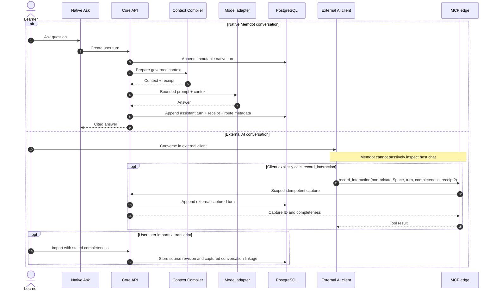

Native chats are complete because Memdot owns both turns. External capture is always marked `single_turn`, `partial_thread`, or `complete_import`; tool availability does not justify claiming a full host conversation. Captured content is memory evidence, not demonstrated learning evidence. A user can mark practice/confusion/insight later under the rules in TRD-LRN-006..009.

## 11. AI proposal and approval

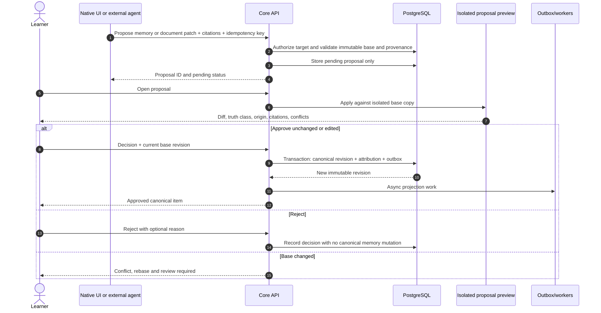

No model adapter, MCP token, workflow, or administrator receives a v1 `memory.commit` capability. Approval attribution records both the proposing agent/model and the deciding user; approval does not convert external/model knowledge into a source assertion.

## 12. Learning Test and Review evidence

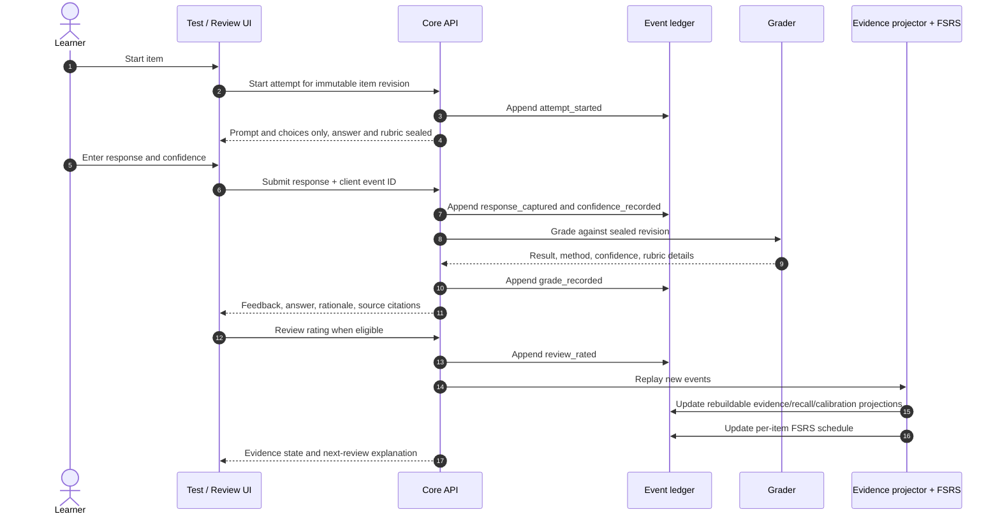

### 12.1 Evidence firewall

- Answer/rubric is server-side and absent from pre-submission, MCP, telemetry, and candidate context.
- A demonstrated event requires an immutable source/item revision, pre-feedback response, no revealed answer, no substantive hint, eligible grade, and explicit assessment event.
- Low-confidence model grading remains provisional. MCQ supports evidence but cannot alone prove delayed demonstration.
- Evidence (`unassessed`, `practicing`, `demonstrated`, `delayed_demonstrated`), recall (`current`, `due`, `lapsed`), and confidence (`guessing`, `unsure`, `sure`) remain separate.
- FSRS schedules review items with initial desired retention 0.90. It does not create a single hidden “mastery” number.
- The append-only ledger must rebuild identical projections; corrections are compensating events.

## 13. Notion two-way synchronization

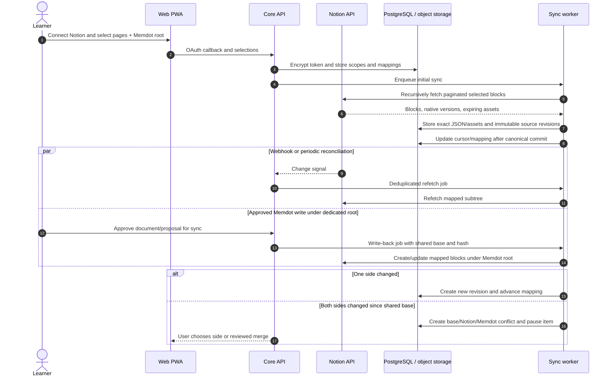

Webhooks are hints, not ordered truth. Periodic reconciliation recovers lost signals. Pages outside the selected Memdot root are always inbound/read-only. Disconnect revokes the connector and stops sync but retains already imported user content until separate deletion.

## 14. Deletion, restore safety, and data export

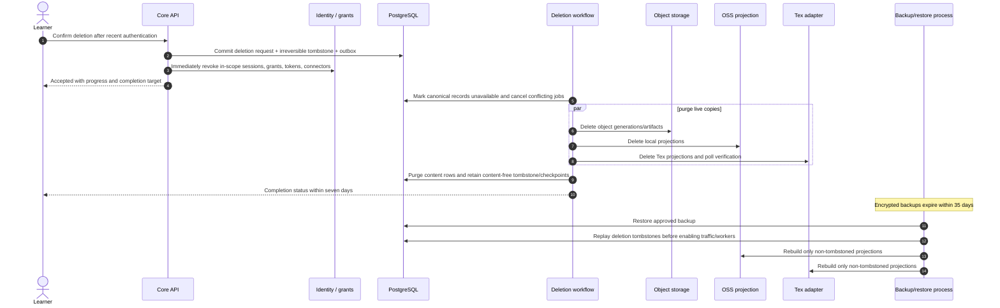

Deletion wins over ingestion, retries, Notion signals, projection replay, and restore. A provider that cannot verify deletion within the release contract cannot receive production data. Export precedes deletion only when explicitly requested; it does not silently delay revocation.

## 15. Tex outage, fallback, and projection rebuild

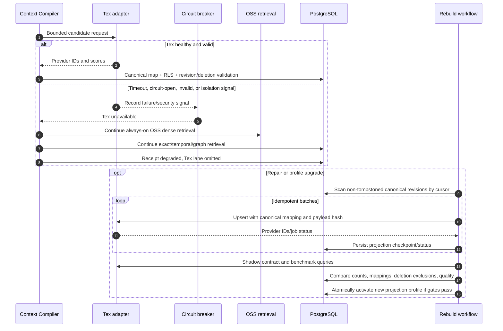

Tex failure never changes the authorization set and never prevents exact/version access. Unknown or cross-account Tex IDs are discarded and treated as security signals. Repeated isolation failure disables Tex globally until reviewed. The OSS projection is maintained continuously, not built after an outage.

## 16. OAuth and external-AI trust boundaries

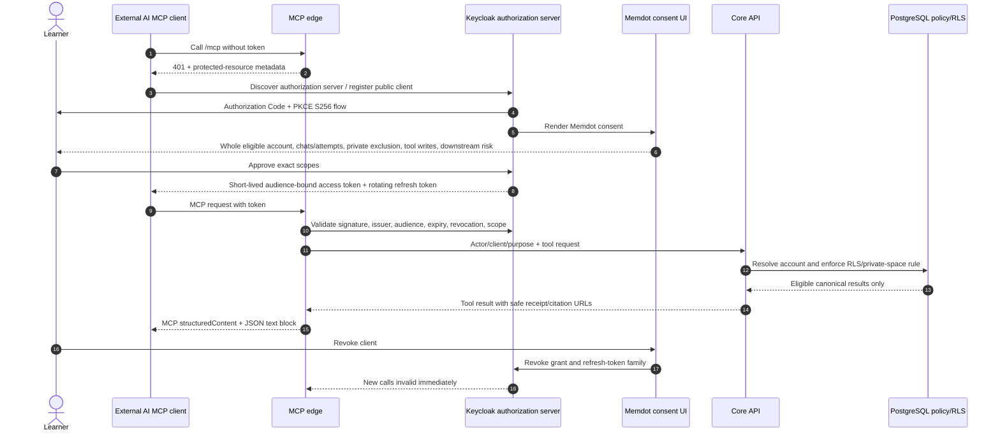

### 16.1 OAuth decisions

- Hosted MCP uses OAuth 2.1 Authorization Code with PKCE S256. Access tokens are short-lived, audience-bound, and contain client identity and scopes; refresh tokens rotate and detect reuse.
- Known clients may be pre-registered. Standards-compatible public clients may use rate-limited dynamic client registration with exact HTTPS redirect URIs, no wildcard redirect, and localhost exceptions only for development.
- The protected resource exposes standards discovery metadata. The browser app and MCP tokens use separate audiences even when Keycloak is the same issuer.
- `memdot.memory.read` means the whole eligible non-private account, including query-relevant retained chats and completed attempts across current and future non-private Spaces. V1 has no MCP per-Space narrowing. Private spaces are excluded in policy and post-provider canonical filtering.
- `memdot.memory.propose` and `memdot.interaction.record` are independent write grants. No v1 external grant can delete conversations or commit canonical memory.
- Returned external data cannot be clawed back; this is stated before consent and on revoke.
- `search({query})` and `fetch({id})` preserve the OpenAI-compatible shapes in TRD-MCP-001..005 and always return user-openable, reauthorized HTTPS citations.

References: [OpenAI MCP server compatibility](https://developers.openai.com/apps-sdk/build/mcp-server#company-knowledge-compatibility), [MCP architecture](https://modelcontextprotocol.io/specification/2025-06-18/architecture), and [Keycloak client registration](https://www.keycloak.org/securing-apps/client-registration).

## 17. Security architecture

### 17.1 Trust boundaries

| Boundary | Required controls |
|---|---|
| Browser to edge | TLS, secure same-site cookies, CSRF for mutations, CSP, schema validation, no secrets/answer keys |
| MCP client to edge | OAuth issuer/audience/scope/revocation, per-client limits, exact tool schemas, safe errors |
| Edge to core | Service identity, private network, signed actor/purpose context, correlation ID |
| Core/workers to PostgreSQL | Separate least-privilege roles, `FORCE RLS`, one account per transaction, migration role isolated |
| Core/workers to storage | Short-lived scoped credentials, immutable generation binding, private buckets |
| Workers to parsers | Sandboxed process/container, read-only input, bounded CPU/RAM/time, no ambient egress or credentials |
| Compiler to providers | Account metadata/filter, timeout/circuit breaker, canonical ID rejoin, output schema validation |
| Model egress | Bounded labeled context, regional route policy, no provider storage/session, route receipt |
| Notion egress | Least-scope OAuth, dedicated write root, cursor/idempotency, encrypted token |
| Operator plane | MFA, JIT access, break-glass reason, audit, no routine content visibility |

### 17.2 Prompt-injection boundary

Source files, Notion blocks, imported chats, OCR output, model results, and Tex metadata are untrusted content. They are delimited as evidence and cannot:

- change system/developer policy;
- request another space/account or private content;
- invoke MCP/Notion/model tools;
- change retrieval filters, model route, retention, or deletion;
- mark themselves authoritative or approved;
- expose secrets, raw object keys, answer rubrics, or internal prompts.

Tool dispatch and authorization occur outside model text. Generated tool arguments are schema-validated and, for writes, create proposals only.

### 17.3 Telemetry boundary

OpenTelemetry carries request/trace IDs, pseudonymous account token, endpoint/tool, status/error code, duration, queue age, provider/model/profile, processing region, token count, cost, and receipt ID. It MUST NOT carry prompts, responses, queries, source titles/text, filenames, attempt answers, cookies, authorization headers, or credentials. Hosted regional log buckets receive allowlisted logs; self-host telemetry has no external exporter by default.

## 18. Operational behavior and observability

### 18.1 Degradation order

When capacity or a provider fails, Memdot degrades in this order:

1. Queue new parsing/projection/sync work durably and expose queue position/state.
2. Disable optional Tex lane and continue exact/graph/temporal/OSS retrieval.
3. Disable semantic reranking and use deterministic fused ranks.
4. Return compiled evidence without generated prose when model generation is unavailable.
5. Reject new work before acceptance with `429` and `Retry-After` if durable capacity is exhausted.

It never drops accepted work, returns stale/deleted/private data, overwrites current revisions, or fabricates a successful state.

### 18.2 Operational signals

- API/MCP latency, status, SLO burn, rate/backpressure.
- Workflow queue age/depth, retries, dead letters, per-stage duration.
- Parser warnings/failures, omitted-page invariant, OCR fallback rate.
- Projection lag/status, provider circuit state, unknown/stale/cross-account candidate rejection.
- Retrieval lane contribution, context partial/degraded rate, citation validation and conflict rate.
- Learning event replay divergence, answer-exposure invariant violations, provisional-grade rate.
- OAuth grants/revocations, invalid audience/scope, private-space denial.
- Deletion checkpoints, provider purge time, backup expiry, tombstone replay.
- Model/provider route, region, token/cost totals without content.

Security alerts for cross-account/private candidates, deleted-data resurrection, RLS bypass indicators, or answer-key exposure are zero-tolerance incidents, not normal SLO errors.

## 19. Architectural validation matrix

| Scenario | Architecture path | Required proof |
|---|---|---|
| Google signup + 18+ | Google -> Keycloak -> onboarding -> account ledger | No account before attestation; under-18 rejection without ID collection |
| File ingestion | Presigned object -> canonical revision -> parse -> dual projections | Deterministic IDs, locators, no omitted successful pages |
| Notion ingestion/sync | OAuth -> exact snapshot -> native adapter -> dedicated-root write | Pagination, rate limit, conflict, disconnect, unsupported-block fixtures |
| Rich-document AI edit | Proposal -> isolated preview -> user decision -> immutable revision | No direct AI commit; stale-base conflict |
| Source-first Ask | Eligibility -> multi-lane retrieve -> canonical rejoin -> receipt -> model | Faithfulness/citation/conflict and budget gates |
| Whole-account MCP | OAuth -> non-private eligibility -> `search`/`fetch` | Exact schemas, openable URLs, zero private/cross-account leakage |
| External capture | Explicit `record_interaction` or import | Completeness preserved; no passive/full-chat claim |
| Test and Review | Sealed item -> events -> grade -> evidence/FSRS projection | No revealed/hinted/post-feedback demonstration; deterministic replay |
| Tex outage | Circuit -> OSS/exact/graph/temporal -> degraded receipt | Quality fallback target and identical authorization/version invariants |
| Historical/conflicting sources | Revision/temporal lane -> conflict set -> citations | No edition blending or score-based silent winner |
| Offline review | Explicit encrypted pin -> versioned pack -> idempotent replay | Account isolation, logout erase, duplicate replay safety |
| Export/delete | Canonical export -> revoke -> tombstone -> all-store purge -> restore replay | Complete manifest, no resurrection, seven/35-day targets |
| Tex-disabled self-host | Docker stack -> OSS retrieval/models -> same public APIs | Full acceptance suite, telemetry off, identical migrations/events |

## 20. Decision boundaries and future evolution

- Tex is an optional adapter until all gates pass; its private implementation is not assumed.
- Exact embedding, reranker, and generation model pins remain deployment profiles chosen by license and benchmark gates. Provider interfaces and data-version requirements are fixed.
- PostgreSQL exact vector search is v1 default. HNSW requires measured corpus need and an operations capacity decision.
- Institution tenancy, minors, payments, collaboration, native mobile, browser extension, Google Drive, Calendar/Tasks, audio/video, and arbitrary web ingestion require later product/ADR work.
- A future backend split must preserve one canonical-write owner per aggregate, the transactional outbox, RLS-equivalent account isolation, immutable public IDs, and receipt semantics. Service count is not a success metric.
